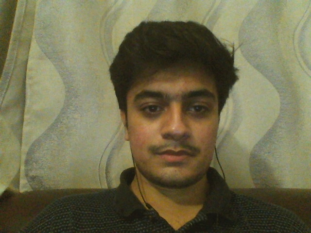

# VIDEO CAPTURING PROJECT


```python
import cv2,time
```

##### First thing is to read the video


```python
video = cv2.VideoCapture(0)
```


```python
check, frame = video.read()
```


```python
print(check)
print(frame)
```

    True
    [[[115 157 158]
      [120 162 163]
      [119 162 158]
      ...
      [144 177 158]
      [134 179 156]
      [140 184 162]]
    
     [[113 159 153]
      [115 160 154]
      [119 165 157]
      ...
      [151 176 160]
      [148 178 159]
      [151 181 163]]
    
     [[112 159 148]
      [113 160 149]
      [112 166 152]
      ...
      [152 178 159]
      [155 178 161]
      [158 181 163]]
    
     ...
    
     [[ 84 141 145]
      [ 76 133 137]
      [ 87 134 132]
      ...
      [ 30  81  81]
      [ 37  81  81]
      [ 35  79  80]]
    
     [[ 95 134 128]
      [ 94 133 127]
      [ 97 133 130]
      ...
      [ 30  77  73]
      [ 34  76  75]
      [ 32  74  72]]
    
     [[104 133 128]
      [100 130 125]
      [ 97 131 126]
      ...
      [ 21  70  66]
      [ 39  84  80]
      [ 32  77  73]]]
    


```python
time.sleep(3)
```


```python
cv2.imshow("Capturing Frame",frame)
```


```python
cv2.waitKey(0)
```


    -1


```python
video.release()
```


```python
cv2.destroyAllWindows()
```


```python
#cv2.imwrite("Capture_Frame.jpg",frame)  # To save the output frame
```



    


#### At this stage it only show the first frame of the video but in order to capture full video we will use While loop


```python
video = cv2.VideoCapture(0)
a=1
while True:
    a+=1
    check, frame = video.read()
   # time.sleep(3)
    cv2.imshow("Capturing video",frame)
    key = cv2.waitKey(1)
    
    if key==ord('q'):  # Press Q to stop the video capturing.
        break
    
video.release()
cv2.destroyAllWindows()

print(f"{a} Ilteration recordered :)") 

```

    69 Ilteration recordered :)
    

# GREAT !!!

# END

# PROJECT BY @YASIRKHANA


```python

```


```python

```
